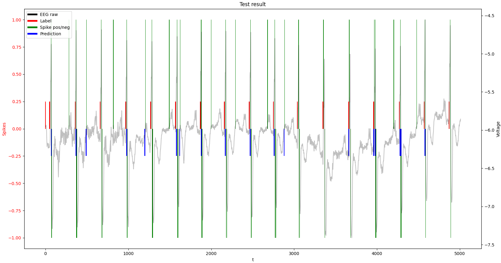

# SpikepropSharp
A C# implementation of the SpikeProp algorithm by Olaf Booij ([source](https://www.sciencedirect.com/science/article/pii/S0020019005001560))

## Requirements
* .NET >=7.0
* Python >=3.8

## Results
| True Positives | False Positives | True Negatives | False Negatives | 
| :---:  | :---: | :---: | :---: |
| 90.4% | 8.8% | 91.2% | 9.6% |

| Sensitivity | Specificity | Accuracy | 
| :---:  | :---: | :---: |
| 90% | 91% | 91% 

**Result sample**:
